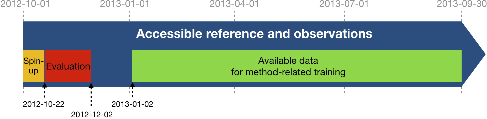
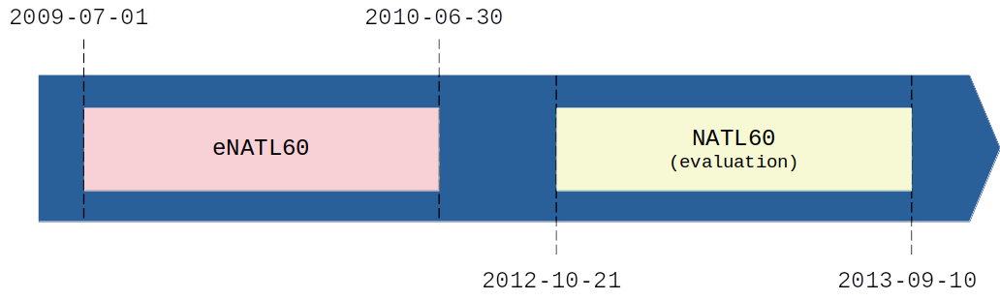
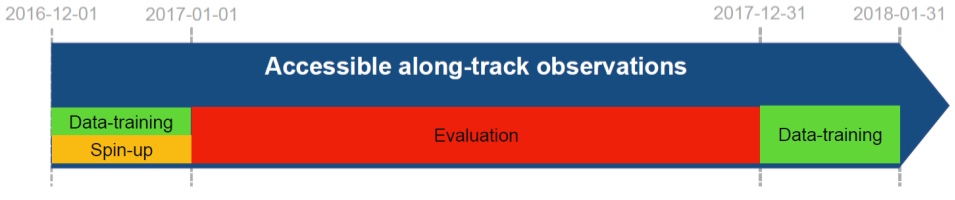

# SSH forecasting Gulfstream region

## Motivation

The goal is to investigate how to best perform forecasting of the Sea Surface High (SSH)
from partial satellite altimetry observations. This study is conduct into the Gulstream region
(33°N;43°N, -65°W;-55°W). There are three experiments:
1. Follows an *Observation System Simulation Experiment* framework:
"Real" full SSH are from a numerical simulation with a realistic, high-resolution ocean circulation model.
Training on the NATL60 dataset.
2. Follows an *Observation System Simulation Experiment* framework:
"Real" full SSH are from a numerical simulation with a realistic, high-resolution ocean circulation model.
Training on the eNATL60 dataset and testing on the NATL60 dataset.
3. Follows an *Observation System Experiment* framework:
Satellite observations are from real sea surface height data from altimeter.

## OSSE Observations

The SSH observations include simulations of Topex-Poseidon, Jason 1, Geosat Follow-On and Envisat. This nadir altimeters constellation was operating during the 2003-2005
period and is still considered as a historical optimal constellation in terms of spatio-temporal coverage.
No observation error is considered in those two experiments.

The two references simulations used are the **NATL60-CJM165** and the **eNATL60-BLB002** simulations, both based on the NEMO model, tide-free, and with a nature run grid resolution of 1/60°.
- **NATL60-CJM165** covers the North Atlantic region, and provides hourly output data. For more detailed information, please visit this link: [NATL60-CJM165 Information](https://github.com/meom-configurations/NATL60-CJM165).
- **eNATL60-BLB002**: This simulation covers an extended area, including the tropical/equatorial Atlantic, the entire Mediterranean Sea, and the Black Sea.
It offers a more realistic simulation, including surface pressure forcing, but it does not have the explicit resolution of tides.
The nature run grid resolution is 1/60° with hourly output. You can find additional information at this link: [eNATL60 Information](https://github.com/ocean-next/eNATL60).

## OSE Observations

The SSH observations include SARAL/Altika, Jason 2, Jason 3, Sentinel 3A, Haiyang-2A
and Cryosat-2 altimeter data. This nadir altimeters constellation was operating during the
20170101-20171231 period. Note that for the mapping the Cryosat-2 altimeter data are not taken
in the mapping to perfor the independent assessment of the various reconstructions.

## Evaluation

The evaluation of the mapping methods is based on the comparison of the SSH reconstructions with the independent Cryosat-2 along-track dataset.
It includes two scores, one based on the Root-Mean-Square Error (RMSE), the other based on Fourier wavenumber spectra.

## First experiment: OSSE natl training

### Data sequence and use

The SSH reconstructions are assessed over the period from 2012-10-22 to 2012-12-02: 42 days,
which is equivalent to two SWOT cycles in the SWOT science phase orbit.
For reconstruction methods that need a spin-up, the observations can be used from 2012-10-01
until the beginning of the evaluation period (21 days). This spin-up period is not included
in the evaluation. For reconstruction methods that need learning from full fields,
the reference data can be used from 2013-01-02 to 2013-09-30. The reference data between
2012-12-02 and 2013-01-02 should never be used so that any learning period or other
method-related-training period can be considered uncorrelated to the evaluation period.

### Leaderboard

<!-- | Method           | Metrics   |        0 |        1 |        2 |        3 |        4 |        5 |        6 | -->
<!-- |:-----------------|:----------|---------:|---------:|---------:|---------:|---------:|---------:|---------:| -->
<!-- | 4DVarNet-starter | µ(RMSE)   |  0.87    |  0.86    |  0.84    |  0.82    |  0.78    |  0.78    |  0.77    | -->
<!-- |                  | λx (km)   |  1.91    |  1.52    |  1.77    |  3.18    |  1.83    |  4.83    |  4.73    | -->
<!-- |                  | λt (days) | 13.55    | 15.86    | 15.95    | 20.79    | 25.04    | 35.23    | 40.55    | -->

| Method           | µ(RMSE) 0/3/6 days | λx (km) 0/3/6 days | λt (days) 0/3/6 days  |
|:-----------------|:------------------:|:------------------:|:---------------------:|
| 4DVarNet-starter | 0.87 / 0.82 / 0.77 | 1.91 / 3.18 / 4.73 | 13.55 / 20.79 / 40.55 |

## Second Experiment: OSSE enatl training

### Data sequence and use

The reconstruction of the SSH is evaluated on the NATL60 domain over the whole year.

For reconstruction methods that require learning from complete SSH fields, training is carried out on the eNATL60 domain over the whole year,
which corresponds to the period from 2009-07-01 to 2010-06-30. The validation subset can be chosen from the latter.

### Leaderboard

<!-- | Method           | Metrics   |        0 |        1 |        2 |        3 |        4 |        5 |         6 | -->
<!-- |:-----------------|:----------|---------:|---------:|---------:|---------:|---------:|---------:|----------:| -->
<!-- | 4DVarNet-starter | µ(RMSE)   |  0.86    |  0.84    |  0.82    |  0.80    |  0.78    |  0.77    |   0.75    | -->
<!-- |  Test 5 nadirs   | λx (km)   |  2.44    |  1.97    |  2.42    |  3.22    |  2.60    |  3.37    | nan       | -->
<!-- |                  | λt (days) | 15.64    | 20.41    | 20.98    | 35.82    | 31.28    | 38.55    | nan       | -->
<!-- |                  |           |          |          |          |          |          |          |           | -->
<!-- | 4DVarNet-starter | µ(RMSE)   |  0.86    |  0.85    |  0.82    |  0.80    |  0.78    |  0.77    |   0.75    | -->
<!-- |  Test 7 nadirs   | λx (km)   |  2.62    |  2.85    |  2.80    |  3.28    |  2.92    |  3.73    | nan       | -->
<!-- |                  | λt (days) | 15.43    | 19.91    | 26.29    | 33.79    | 34.86    | 38.73    | nan       | -->

| Method                    | µ(RMSE) 0/3/6 days | λx (km) 0/3/6 days | λt (days) 0/3/6 days |
|:--------------------------|:------------------:|:------------------:|:--------------------:|
| 4DVarNet-starter 5 nadirs | 0.86 / 0.80 / 0.75 | 2.44 / 3.22 / nan  | 15.64 / 35.82 / nan  |
| 4DVarNet-starter 7 nadirs | 0.86 / 0.80 / 0.75 | 2.62 / 3.28 / nan  | 15.43 / 33.79 / nan  |

## Third Experiment: OSE

### Data sequence and use

The SSH reconstructions are assessed over the period from 2017-01-01 to 2017-12-31.

For reconstruction methods that need a spin-up, the observations can be used from 2016-12-01 until the beginning of the evaluation period (31 days).
This spin-up period is not included in the evaluation. For reconstruction methods that need learning from full fields,
the baseline reconstruction or duacs reconstrcution can be used from 2017-01-01 to 2017-12-31. The altimeter data from Cryosat-2 should never be used
so that any reconstruction can be considered uncorrelated to the evaluation period.

### Leaderboard

<!-- | Method           | Metrics |      0 |      1 |      2 |      3 |      4 |      5 |      6 |    7 |    8 |    9 | -->
<!-- |:-----------------|--------:|-------:|-------:|-------:|-------:|-------:|-------:|-------:|-----:|-----:|-----:| -->
<!-- | 4DVarNet-starter | µ(RMSE) |   0.83 |   0.81 |   0.80 |   0.79 |   0.77 |   0.75 |   0.72 |      |      |      | -->
<!-- |                  | λx (km) | 150    | 155    | 177    | 208    | 222    | 235    | 246    |      |      |      | -->
<!-- | Glorys forecast  | µ(RMSE) |   0.51 |   0.49 |   0.47 |   0.45 |   0.43 |   0.42 |   0.41 | 0.40 | 0.39 | 0.38 | -->
<!-- |                  | λx (km) | 450    | 491    |   0    |   0    |   0    |   0    |   0    | 0    | 0    | 0    | -->

| Method           | µ(RMSE) 0/3/6 days | λx (km) 0/3/6 days |
|:-----------------|:------------------:|:------------------:|
| 4DVarNet-starter | 0.83 / 0.79 / 0.72 | 150 / 208 / 246    |
| Glorys           | 0.51 / 0.45 / 0.41 | 450 / nan / nan    |
